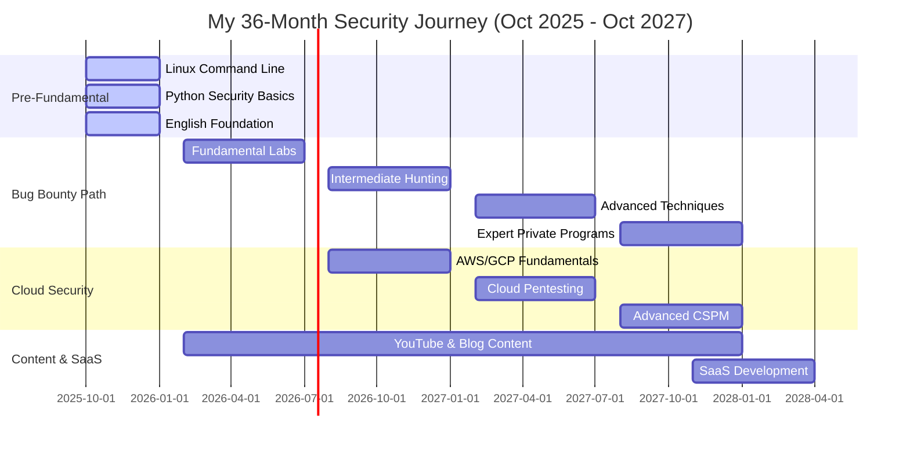

# 🔐 ZeroDay Indonesia | Bug Bounty & Cloud Security Journey

<div align="center">
  
[](https://git.io/typing-svg)


[](https://github.com/zerodayid14-alt)
[](https://github.com/zerodayid14-alt?tab=followers)
[](https://github.com/zerodayid14-alt?tab=repositories)

</div>

---

## 🎯 About Me

```python
#!/usr/bin/env python3
# -*- coding: utf-8 -*-

class SecurityLearner:
    def __init__(self):
        self.username = "zerodayid14-alt"
        self.name = "ZeroDay Indonesia"
        self.role = "Bug Bounty Hunter & Cloud Security Engineer (in Training)"
        self.location = "Indonesia 🇮🇩"
        self.started = "October 2025"
        self.languages = ["Indonesian", "English (Learning)"]
        
        self.current_phase = {
            "phase": "Pre-Fundamental (Month 1-4)",
            "timeline": "October 2025 - January 2026",
            "status": "🟢 Active Learning"
        }
        
        self.learning_focus = {
            "fundamentals": [
                "🐧 Linux Command Line & Bash Scripting",
                "🐍 Python for Security Automation",
                "🌐 HTTP/HTTPS & Web Fundamentals",
                "🔧 Git & GitHub Workflow"
            ],
            "platforms": [
                "OverTheWire (Bandit, Leviathan, Natas)",
                "Exercism.org (Python Track)",
                "Codewars (Python Kata)",
                "LinuxJourney.com"
            ],
            "tools_mastering": [
                "Terminal: tmux, zsh + oh-my-zsh",
                "Editor: VSCode, Neovim",
                "Modern CLI: bat, exa, ripgrep, fd",
                "Version Control: Git, GitHub Actions"
            ]
        }
        
        self.future_roadmap = {
            "month_5_10": "🔐 Bug Bounty Fundamentals (PortSwigger Labs)",
            "month_11_16": "📗 Intermediate Web Security + AWS Basics",
            "month_17_22": "📙 Advanced Attacks + Cloud Pentesting",
            "month_23_28": "📕 Expert Level + Private Programs",
            "month_29_36": "🚀 SaaS Launch (Cloud Security Tool)"
        }
        
        self.goals_2026 = [
            "✅ Complete Bandit Level 0-34",
            "✅ Build 5+ Python Security Tools",
            "✅ Complete 50+ Exercism Exercises",
            "✅ Submit First Valid Bug Report",
            "✅ Earn First Bounty ($50-100)",
            "✅ TOEFL 60-70 / IELTS 5.0-5.5"
        ]
    
    def daily_routine(self):
        return {
            "morning_2h": "🌅 English Learning (Duolingo + Speaking)",
            "day_4h": "💻 Linux Practice + Python Coding",
            "evening_3h": "🔍 Security Labs + Tool Building",
            "night_1h": "📝 Documentation + GitHub Updates"
        }
    
    def get_stats(self):
        return {
            "days_learning": self.calculate_days_since_start(),
            "commits_streak": "Building consistency...",
            "tools_built": 0,  # Will grow!
            "labs_completed": 0,  # Starting from zero
            "bugs_found": 0,  # Journey begins
            "bounties_earned": "$0 (Yet!)"
        }
    
    def calculate_days_since_start(self):
        from datetime import datetime
        start = datetime(2025, 10, 1)
        today = datetime.now()
        return (today - start).days

# Initialize journey
learner = SecurityLearner()
print(f"🎯 {learner.name} | Started: {learner.started}")
print(f"📍 Current: {learner.current_phase['phase']}")
print(f"🚀 Next Milestone: First 30 Days of Consistent Learning!")
```

---

## 🛠️ Tech Stack & Learning Arsenal

### 🐧 Linux & Terminal (Currently Learning)


### 🐍 Python & Development


### 🔐 Security Tools (Coming Soon)


### ☁️ Cloud Security (Roadmap)


---

## 📊 GitHub Statistics

<div align="center">


</div>

---

## 🔥 Contribution Activity

<div align="center">

[](https://git.io/streak-stats)


</div>

---

## 🐍 Contribution Snake

<div align="center">

<picture>
  <source media="(prefers-color-scheme: dark)" srcset="https://raw.githubusercontent.com/zerodayid14-alt/zerodayid14-alt/output/github-contribution-grid-snake-dark.svg">
  <source media="(prefers-color-scheme: light)" srcset="https://raw.githubusercontent.com/zerodayid14-alt/zerodayid14-alt/output/github-contribution-grid-snake.svg">
  
</picture>

</div>

---

## 🏅 Trophy Case

<div align="center">

[](https://github.com/ryo-ma/github-profile-trophy)

</div>

---

## 📁 Repository Roadmap (Building in Progress)

```
📦 zerodayid14-alt's GitHub
│
├── 🐧 linux-scripts/                    [🔄 IN PROGRESS]
│   ├── file-organizer.sh               # Auto organize files by extension
│   ├── log-parser.sh                   # Parse & analyze log files
│   ├── backup-automation.sh            # Automated backup system
│   ├── system-monitor.sh               # System resource monitoring
│   └── README.md
│
├── 🐍 python-security-tools/           [🔄 IN PROGRESS]
│   ├── subdomain_enum.py               # DNS-based subdomain finder
│   ├── http_analyzer.py                # HTTP header security checker
│   ├── port_scanner.py                 # Multi-threaded port scanner
│   ├── log_parser.py                   # Advanced log analysis
│   ├── password_checker.py             # Password strength validator
│   ├── requirements.txt
│   └── README.md
│
├── 🔐 portswigger-labs/                [📅 COMING SOON - Month 5]
│   ├── apprentice/
│   │   ├── xss/                        # XSS lab solutions
│   │   ├── sqli/                       # SQL injection writeups
│   │   ├── csrf/                       # CSRF challenges
│   │   └── access-control/             # IDOR & privilege escalation
│   ├── practitioner/
│   └── README.md
│
├── 📝 ctf-writeups/                    [🔄 IN PROGRESS]
│   ├── overthewire/
│   │   ├── bandit/
│   │   │   ├── level-0-10.md          # Bandit walkthrough part 1
│   │   │   ├── level-11-20.md         # Bandit walkthrough part 2
│   │   │   └── level-21-34.md         # Bandit walkthrough part 3
│   │   ├── leviathan/
│   │   │   └── level-0-8.md
│   │   └── natas/
│   │       └── level-0-10.md
│   ├── tryhackme/                      [📅 Month 5+]
│   └── hackthebox/                     [📅 Month 11+]
│
├── ☁️ cloud-security/                  [📅 Month 11+]
│   ├── aws-fundamentals/
│   │   ├── s3-security/
│   │   ├── iam-policies/
│   │   └── ec2-hardening/
│   ├── cloudgoat-scenarios/
│   └── terraform-security/
│
├── 📚 learning-notes/                  [🔄 ACTIVE]
│   ├── linux-cheatsheet.md            # Essential Linux commands
│   ├── python-snippets.md             # Python security patterns
│   ├── bash-scripting-guide.md        # Bash automation tips
│   ├── git-workflow.md                # Git best practices
│   ├── http-fundamentals.md           # Web protocols notes
│   └── owasp-top10.md                 # OWASP vulnerabilities
│
├── 🎬 content-materials/               [🔄 IN PROGRESS]
│   ├── video-scripts/
│   │   ├── linux-basics-series/
│   │   ├── python-security-tools/
│   │   └── overthewire-walkthroughs/
│   ├── blog-articles/
│   │   ├── my-journey-into-security.md
│   │   ├── bandit-complete-guide.md
│   │   └── python-tools-tutorial.md
│   └── demo-code/
│
└── 🔧 automation-scripts/              [📅 Month 3+]
    ├── github-automation/
    ├── content-scheduler/
    └── recon-pipeline/

Legend:
🔄 IN PROGRESS  - Currently building
📅 COMING SOON  - Scheduled in roadmap
✅ COMPLETED    - Ready to use
```

---

## 🚀 Current Projects & Focus

<div align="center">

<table>
<tr>
<td width="50%">

### 🐧 [Linux Automation Scripts](https://github.com/zerodayid14-alt/linux-scripts)
**Status:** 🔄 Building (Week 1-2)

**Bash scripting toolkit for daily automation**
- 📁 File organizer by extension
- 📊 System log parser with regex
- 💾 Automated backup with tar/gzip
- 🔧 Cron job integration

**Skills Learning:**
- Bash scripting fundamentals
- File operations & permissions
- Regex pattern matching
- Process automation

**Progress:** 1/3 scripts completed

</td>
<td width="50%">

### 🐍 [Python Security Tools](https://github.com/zerodayid14-alt/python-security-tools)
**Status:** 🔄 Building (Week 2-4)

**Collection of beginner security utilities**
- 🌐 Subdomain enumerator (DNS queries)
- 🔍 HTTP header analyzer
- 🔓 Port scanner (threading)
- 🔐 Password strength validator
- 📊 Log file parser

**Skills Learning:**
- Python 3.12+ syntax
- Requests library
- Socket programming
- Threading basics

**Progress:** Planning phase

</td>
</tr>

<tr>
<td width="50%">

### 📝 [CTF Writeups](https://github.com/zerodayid14-alt/ctf-writeups)
**Status:** 🔄 Active Documentation

**Learning journey documentation**
- ✅ OverTheWire Bandit (0-10 completed)
- 🔄 Leviathan (starting soon)
- 🔄 Natas (web challenges)
- 📝 Detailed explanations in English
- 💡 Lessons learned section

**Format:**
- Step-by-step walkthroughs
- Commands used
- Concepts explained
- Screenshots included

**Target:** Complete Bandit 0-34 by Month 4

</td>
<td width="50%">

### 📚 [Security Learning Notes](https://github.com/zerodayid14-alt/learning-notes)
**Status:** 🔄 Daily Updates

**Personal knowledge base in Markdown**
- 📖 Linux command reference
- 🐍 Python code snippets
- 🔧 Tool configurations
- 🎓 Study progress tracker
- 📝 English vocabulary (tech terms)

**Organization:**
- Obsidian-compatible format
- Tagged for easy search
- Examples included
- Updated daily

**Goal:** 100+ notes by Month 4

</td>
</tr>

</table>

</div>

---

## 📈 Learning Progress & Roadmap

<div align="center">



</div>

---

## 🎯 Milestone Tracker

<div align="center">

### 📍 Current Phase: Pre-Fundamental (Month 1-4)
**Timeline:** October 2025 - January 2026

| 🏆 Milestone | 📊 Progress | 🎯 Target | 🗓️ Deadline | ✅ Status |
|-------------|------------|-----------|------------|----------|
| **OverTheWire Bandit** | 10/34 levels | Level 34 | Jan 2026 | 🟡 30% |
| **Python Exercism** | 5/50 exercises | 50 complete | Jan 2026 | 🟡 10% |
| **Codewars Kata** | 0/30 kata | 30 (6-7 kyu) | Jan 2026 | 🔴 0% |
| **Python Tools Built** | 0/5 tools | 5 working tools | Jan 2026 | 🔴 0% |
| **Bash Scripts** | 0/3 scripts | 3 automation | Jan 2026 | 🔴 0% |
| **GitHub Repos** | 2/5 repos | 5 public repos | Jan 2026 | 🟡 40% |
| **English Level** | - | TOEFL 60-70 | Jan 2026 | 🔴 Start |
| **Daily Commits** | 7 days | 90+ day streak | Jan 2026 | 🟢 Week 1 |

### 📅 Upcoming Milestones (Month 5-10)

| 🏆 Milestone | 🎯 Target | 🗓️ Timeline |
|-------------|-----------|------------|
| **First Valid Bug** | 1 bug report | Month 6 |
| **PortSwigger Apprentice** | 20+ labs | Month 5-7 |
| **OWASP Juice Shop** | 1-2 star (20 challenges) | Month 8 |
| **First Bounty** | $50-100 earned | Month 9-10 |
| **Writeups Published** | 10+ English articles | Month 10 |
| **YouTube Channel** | First 5 videos | Month 8-10 |

</div>

---

## 💻 Weekly Activity & Consistency

<div align="center">

<!--START_SECTION:waka-->
```text
📊 This Week's Coding Time (Starting to build the habit!)

Bash         45 mins         ██████░░░░░░░░░░░░░░░  30.0%
Python       30 mins         ████░░░░░░░░░░░░░░░░░  20.0%
Markdown     30 mins         ████░░░░░░░░░░░░░░░░░  20.0%
English      45 mins         ██████░░░░░░░░░░░░░░░  30.0%

🎯 Goal: 50+ hours/week by Month 2
📈 Current: Building momentum...
🔥 Streak: 7 days (Keep going!)
```
<!--END_SECTION:waka-->

</div>

---

## 📝 Latest Learning Updates & Blog

<div align="center">

<!-- BLOG-POST-LIST:START -->
📅 **Week 1 Updates (October 2025)**
- 🎉 Started my security journey on GitHub!
- 🐧 Completed Bandit Level 0-10 (OverTheWire)
- 🐍 Setup Python 3.12 + VSCode environment
- 📚 Created first learning notes repository
- 🌐 Practicing English daily (2 hours)

📝 **Coming Soon:**
- Complete guide: "Bandit 0-34 Walkthrough"
- Tutorial: "Building Your First Python Security Tool"
- Article: "My Journey from Zero to Bug Bounty Hunter"
<!-- BLOG-POST-LIST:END -->

➡️ [**Follow my journey on Medium**](https://medium.com/@zerodayid14) *(Coming Soon)*

</div>

---

## 🎓 Learning Resources & Platforms

<details>
<summary>📖 <b>Books I'm Reading (Click to expand)</b></summary>

### 📚 Current Reading (Month 1-4)
- 🔄 **Linux Basics for Hackers** - OccupyTheWeb
- 🔄 **Python Crash Course 3rd Edition** - Eric Matthes
- 🔄 **Automate the Boring Stuff** - Al Sweigart
- 📖 **The Linux Command Line** - William Shotts (Free PDF)

### 📅 Next Books (Month 5+)
- 📅 **Bug Bounty Bootcamp** - Vickie Li (Month 5)
- 📅 **Black Hat Python 2nd Edition** - Justin Seitz (Month 8)
- 📅 **Real-World Bug Hunting** - Peter Yaworski (Month 11)
- 📅 **AWS Security** - Manning (Month 11)

**Budget:** ~$315 spread over 17 months

</details>

<details>
<summary>🎓 <b>Platforms I'm Using (Click to expand)</b></summary>

### 🐧 Linux & Command Line
- ✅ **OverTheWire** - Bandit, Leviathan, Natas (Active)
- ✅ **LinuxJourney.com** - Structured curriculum (Active)
- ✅ **CmdChallenge.com** - Command practice (Weekly)

### 🐍 Python Learning
- ✅ **Exercism.org** - Mentored exercises (Daily)
- 🔄 **Codewars** - Kata challenges (Starting)
- ✅ **Real Python** - Articles & tutorials (Reference)

### 🔐 Security Labs (Starting Month 5)
- 📅 **PortSwigger Academy** - Web security labs
- 📅 **OWASP Juice Shop** - Vulnerable web app
- 📅 **TryHackMe** - Guided security rooms
- 📅 **PentesterLab** - Hands-on exercises

### ☁️ Cloud Security (Starting Month 11)
- 📅 **AWS Skill Builder** - Free courses
- 📅 **GCP Skills Boost** - Google Cloud training
- 📅 **CloudGoat** - AWS pentesting scenarios
- 📅 **Kubernetes Goat** - K8s security

### 🌐 English Learning
- ✅ **Duolingo** - Daily grammar (30 min/day)
- ✅ **BBC Learning English** - Podcasts
- ✅ **Anki** - Tech vocabulary flashcards
- 📅 **iTalki** - 1-on-1 tutor (Month 7+)

</details>

<details>
<summary>🛠️ <b>Tools I'm Mastering (Click to expand)</b></summary>

### ✅ Currently Learning (Month 1-4)
```bash
# Terminal & Shell
zsh + oh-my-zsh          # Modern shell
tmux                     # Terminal multiplexer
WezTerm/Alacritty       # Fast terminals

# Modern CLI Tools
bat                      # Better cat
exa/eza                  # Better ls
ripgrep (rg)            # Better grep
fd                       # Better find
tldr                     # Better man
ranger/nnn              # File managers

# Editors
neovim + LazyVim        # Advanced editing
VSCode                   # Python development

# Version Control
git                      # Version control
GitHub CLI              # GitHub integration
```

### 📅 Coming Soon (Month 5+)
```bash
# Web Security
Burp Suite Community    # Proxy & testing
Firefox + FoxyProxy     # Browser setup
Wappalyzer             # Tech detection

# Bug Bounty Tools (Month 11+)
subfinder              # Subdomain enum
httpx                  # HTTP probing
nuclei                 # Vulnerability scanner
ffuf                   # Fuzzing
sqlmap                 # SQL injection
```

</details>

---

## 🎬 Content Creation Journey

<div align="center">

### 📺 YouTube | 📝 Blog | 🐦 Social Media

**Status:** 🔄 Planning & Learning Phase

[](https://youtube.com/@zerodayid14) *(Coming Soon)*
[](https://medium.com/@zerodayid14) *(Coming Soon)*
[](https://twitter.com/zerodayid14) *(Coming Soon)*
[](https://dev.to/zerodayid14) *(Coming Soon)*

### 🎯 Content Roadmap

**Phase 1 (Month 1-4): Foundation**
- 📝 Weekly progress updates on GitHub
- 🐧 Bandit walkthrough series
- 🐍 Python security tool tutorials
- 📚 Learning notes & cheatsheets

**Phase 2 (Month 5-10): Bug Bounty Basics**
- 🎥 PortSwigger lab walkthroughs
- 📝 First bug report writeups
- 🔧 Tool development videos
- 📖 Beginner-friendly guides

**Phase 3 (Month 11+): Advanced Content**
- 🎯 High-quality bug bounty writeups
- ☁️ Cloud security tutorials
- 🛠️ Open-source tool releases
- 🎤 Conference talk submissions

### 📊 Content Goals

| Platform | Month 4 | Month 10 | Month 16 |
|----------|---------|----------|----------|
| 📝 Blog Articles | 5 | 20 | 50 |
| 🎥 YouTube Videos | 0 | 10 | 30 |
| 🐦 Twitter Followers | 50 | 500 | 2000 |
| ⭐ GitHub Stars | 10 | 100 | 500 |

</div>

---

## 💰 Income & Monetization Roadmap

<div align="center">

### 📊 Projected Monthly Income (3-Year Journey)

| Phase | Bug Bounty | Content | Consulting | Total/Month |
|-------|-----------|---------|------------|-------------|
| **Month 1-4** (Pre-Fund) | $0 | $0 | $0 | **$0** |
| **Month 5-10** (First Bugs) | $50-200 | $0 | $0 | **$50-200** |
| **Month 11-16** (Intermediate) | $200-500 | $100-300 | $0 | **$300-800** |
| **Month 17-22** (Advanced) | $500-1k | $300-600 | $200-500 | **$1k-2.1k** |
| **Month 23-28** (Expert) | $800-1.5k | $600-1k | $500-1k | **$1.9k-3.5k** |
