# 🔐 ZeroDay Indonesia | Bug Bounty & Cloud Security Journey

<div align="center">
  
[](https://git.io/typing-svg)


[](https://github.com/zerodayid14-alt)
[](https://github.com/zerodayid14-alt?tab=followers)
[](https://github.com/zerodayid14-alt?tab=repositories)

</div>

---

## 🎯 About Me

```python
#!/usr/bin/env python3
# -*- coding: utf-8 -*-

class SecurityLearner:
    def __init__(self):
        self.username = "zerodayid14-alt"
        self.name = "ZeroDay Indonesia"
        self.role = "Bug Bounty Hunter & Cloud Security Engineer (in Training)"
        self.location = "Indonesia 🇮🇩"
        self.started = "October 2025"
        self.languages = ["Indonesian", "English (Learning)"]
        
        self.current_phase = {
            "phase": "Pre-Fundamental - Starting from Zero",
            "status": "🟢 Day 1 - Building Foundation"
        }
        
        self.learning_focus = {
            "fundamentals": [
                "🐧 Linux Command Line & Bash Scripting",
                "🐍 Python for Security Automation",
                "🌐 HTTP/HTTPS & Web Fundamentals",
                "🔧 Git & GitHub Workflow"
            ],
            "platforms": [
                "OverTheWire (Bandit, Leviathan, Natas)",
                "Exercism.org (Python Track)",
                "Codewars (Python Kata)",
                "LinuxJourney.com"
            ],
            "tools_learning": [
                "Terminal: tmux, zsh + oh-my-zsh",
                "Editor: VSCode, Neovim + LazyVim",
                "Modern CLI: bat, exa, ripgrep, fd, tldr",
                "Version Control: Git, GitHub Actions"
            ]
        }
        
        self.roadmap_path = {
            "pre_fundamental": "Linux + Python + English Foundation",
            "bug_bounty_fundamental": "PortSwigger Labs + OWASP Top 10",
            "bug_bounty_intermediate": "SQLi, XSS, SSRF, API Testing",
            "bug_bounty_advanced": "OAuth, GraphQL, HTTP Smuggling",
            "cloud_security_fundamental": "AWS/GCP/Azure Basics + IAM",
            "cloud_security_intermediate": "CloudGoat + IaC Security",
            "cloud_security_advanced": "CSPM + Kubernetes Security",
            "expert_phase": "Private Programs + Tool Development",
            "saas_development": "Cloud Security SaaS for Startups"
        }
        
        self.daily_goals = [
            "📖 Learn & practice consistently",
            "💻 Build real security tools",
            "📝 Document everything I learn",
            "🌐 Improve English skills daily",
            "🤝 Share knowledge with community",
            "🎯 Stay humble, keep learning"
        ]
    
    def daily_routine(self):
        return {
            "morning": "🌅 English Learning (Duolingo + Speaking Practice)",
            "day": "💻 Linux Practice + Python Coding",
            "evening": "🔍 Security Labs + Tool Building",
            "night": "📝 Documentation + GitHub Updates"
        }
    
    def get_current_stats(self):
        return {
            "journey_status": "Just Started! 🚀",
            "commits_today": "Building the habit...",
            "tools_built": "Planning phase",
            "labs_completed": "Starting from zero",
            "learning_streak": "Day 1 - Let's go!"
        }

# Initialize journey
learner = SecurityLearner()
print(f"🎯 {learner.name} | Started: {learner.started}")
print(f"📍 Status: {learner.current_phase['status']}")
print(f"🚀 Focus: Learning one step at a time!")
```

---

## 🛠️ Tech Stack & Tools Arsenal

### 🐧 Linux & Terminal (Currently Learning)


**Modern CLI Tools:**
- `bat` (better cat), `exa/eza` (better ls)
- `ripgrep` (better grep), `fd` (better find)
- `tldr` (better man), `ranger/nnn` (file managers)

### 🐍 Python & Development


**Python Security Libraries:**
- `requests`, `httpx` (HTTP requests)
- `beautifulsoup4`, `lxml` (parsing)
- `typer`, `rich` (CLI tools)
- `asyncio` (async programming)

### 🔐 Bug Bounty Tools (Roadmap)

**Web Security Testing:**


**Reconnaissance & Scanning:**
- `subfinder`, `assetfinder`, `amass` (subdomain enum)
- `httpx` (HTTP probing), `katana` (crawling)
- `nuclei` (vulnerability scanner)
- `ffuf`, `feroxbuster` (fuzzing)

**Exploitation Tools:**
- `sqlmap`, `ghauri` (SQL injection)
- `dalfox`, `XSStrike` (XSS)
- `jwt_tool` (JWT attacks)
- `graphw00f`, `clairvoyance` (GraphQL)

### ☁️ Cloud Security Tools (Roadmap)


**Cloud Security Audit:**
- `prowler` v4 (AWS/GCP/Azure audit)
- `ScoutSuite` (multi-cloud security)
- `Steampipe` (query cloud resources)
- `CloudQuery` (data collection)

**Container & IaC Security:**
- `Trivy` (container scanning)
- `Checkov` (IaC security)
- `Terrascan`, `tfsec` (Terraform)
- `Snyk IaC` (policy enforcement)

**Kubernetes Security:**
- `kube-bench` (CIS benchmark)
- `kube-hunter` (penetration testing)
- `kubescape` (security scanning)
- `Falco` (runtime threat detection)

---

## 📊 GitHub Statistics

<div align="center">


</div>

---

## 🔥 Contribution Activity

<div align="center">

[](https://git.io/streak-stats)


</div>

---

## 🐍 Contribution Snake

<div align="center">

<picture>
  <source media="(prefers-color-scheme: dark)" srcset="https://raw.githubusercontent.com/zerodayid14-alt/zerodayid14-alt/output/github-contribution-grid-snake-dark.svg">
  <source media="(prefers-color-scheme: light)" srcset="https://raw.githubusercontent.com/zerodayid14-alt/zerodayid14-alt/output/github-contribution-grid-snake.svg">
  
</picture>

</div>

---

## 🏅 Trophy Case

<div align="center">

[](https://github.com/ryo-ma/github-profile-trophy)

</div>

---

## 📁 Repository Structure & Roadmap

```
📦 zerodayid14-alt's GitHub
│
├── 🐧 linux-scripts/                    [📅 Planned]
│   ├── file-organizer.sh               # Auto organize files by extension
│   ├── log-parser.sh                   # Parse & analyze log files
│   ├── backup-automation.sh            # Automated backup system
│   └── README.md
│
├── 🐍 python-security-tools/           [📅 Planned]
│   ├── subdomain_enum.py               # DNS-based subdomain finder
│   ├── http_analyzer.py                # HTTP header security checker
│   ├── port_scanner.py                 # Multi-threaded port scanner
│   ├── log_parser.py                   # Advanced log analysis
│   ├── password_checker.py             # Password strength validator
│   ├── requirements.txt
│   └── README.md
│
├── 🔐 portswigger-labs/                [📅 Future]
│   ├── apprentice/
│   │   ├── xss/                        # XSS lab solutions
│   │   ├── sqli/                       # SQL injection writeups
│   │   ├── csrf/                       # CSRF challenges
│   │   └── access-control/             # IDOR & privilege escalation
│   ├── practitioner/
│   └── expert/
│
├── 📝 ctf-writeups/                    [📅 Planned]
│   ├── overthewire/
│   │   ├── bandit/                     # Level 0-34
│   │   ├── leviathan/                  # Level 0-8
│   │   └── natas/                      # Level 0-10
│   ├── tryhackme/                      # TryHackMe rooms
│   └── hackthebox/                     # HTB challenges
│
├── ☁️ cloud-security/                  [📅 Future]
│   ├── aws-fundamentals/
│   │   ├── s3-security/
│   │   ├── iam-policies/
│   │   └── ec2-hardening/
│   ├── gcp-security/
│   ├── azure-security/
│   ├── cloudgoat-scenarios/
│   ├── terraform-security/
│   └── kubernetes-security/
│
├── 📚 learning-notes/                  [🔄 Active]
│   ├── linux-cheatsheet.md            # Essential Linux commands
│   ├── python-snippets.md             # Python security patterns
│   ├── bash-scripting-guide.md        # Bash automation tips
│   ├── git-workflow.md                # Git best practices
│   ├── http-fundamentals.md           # Web protocols notes
│   ├── owasp-top10.md                 # OWASP vulnerabilities
│   └── burp-suite-guide.md            # Burp Suite workflows
│
├── 🎬 content-materials/               [📅 Planned]
│   ├── video-scripts/
│   │   ├── linux-basics-series/
│   │   ├── python-security-tools/
│   │   └── overthewire-walkthroughs/
│   ├── blog-articles/
│   └── demo-code/
│
└── 🔧 automation-scripts/              [📅 Future]
    ├── recon-pipeline/
    ├── github-automation/
    └── content-scheduler/

Legend:
🔄 ACTIVE     - Working on it now
📅 PLANNED    - Coming soon
📅 FUTURE     - In the roadmap
```

---

## 🚀 Learning Path & Roadmap

<div align="center">

### 📚 My Security Journey

```mermaid
graph TB
    A[🔰 Pre-Fundamental] --> B[📘 Bug Bounty Fundamental]
    B --> C[📗 Bug Bounty Intermediate]
    C --> D[📙 Bug Bounty Advanced]
    D --> E[📕 Bug Bounty Expert]
    
    A --> F[☁️ Cloud Security Fundamental]
    F --> G[☁️ Cloud Security Intermediate]
    G --> H[☁️ Cloud Security Advanced]
    H --> I[☁️ Cloud Security Expert]
    
    E --> J[🚀 SaaS Development]
    I --> J
    
    style A fill:#1a1b27,stroke:#00FF41,color:#00FF41
    style B fill:#1a1b27,stroke:#00FF41,color:#00FF41
    style C fill:#1a1b27,stroke:#00FF41,color:#00FF41
    style D fill:#1a1b27,stroke:#00FF41,color:#00FF41
    style E fill:#1a1b27,stroke:#00FF41,color:#00FF41
    style F fill:#1a1b27,stroke:#00FF41,color:#00FF41
    style G fill:#1a1b27,stroke:#00FF41,color:#00FF41
    style H fill:#1a1b27,stroke:#00FF41,color:#00FF41
    style I fill:#1a1b27,stroke:#00FF41,color:#00FF41
    style J fill:#1a1b27,stroke:#00FF41,color:#00FF41
```



</div>

### 🎯 Learning Phases

<details>
<summary><b>🔰 Phase 1: Pre-Fundamental</b></summary>

**Foundation Building**
- 🐧 Linux Command Line mastery (OverTheWire Bandit 0-34)
- 🐍 Python basics to intermediate
- 🌐 English learning (TOEFL/IELTS preparation)
- 📝 Build 5 Python security tools
- 📚 Complete Exercism Python track (50+ exercises)
- 🏆 Codewars kata (30+ challenges, 6-7 kyu)

**Tools to Master:**
- Terminal: `zsh`, `tmux`, `bat`, `exa`, `ripgrep`, `fd`
- Editor: `neovim`, `VSCode`
- Python: `requests`, `beautifulsoup4`, `typer`, `rich`

</details>

<details>
<summary><b>📘 Phase 2: Bug Bounty Fundamental</b></summary>

**Web Security Basics**
- PortSwigger Academy (Apprentice level 20+ labs)
- OWASP Top 10 hands-on practice
- HTTP fundamentals, authentication, access control
- XSS, SQLi, CSRF, IDOR basics
- First bug submissions to VDP programs

**Platforms:**
- PortSwigger Web Security Academy
- OWASP Juice Shop
- TryHackMe (OWASP Top 10 path)
- PentesterLab Introduction

**Tools:**
- Burp Suite Community
- Browser extensions (FoxyProxy, Wappalyzer)
- Firefox DevTools

</details>

<details>
<summary><b>📗 Phase 3: Bug Bounty Intermediate</b></summary>

**Advanced Web Attacks**
- PortSwigger Practitioner labs (50+)
- Advanced XSS (stored, DOM, filter bypass)
- SQL injection (all techniques)
- SSRF, XXE, SSTI, Command Injection
- JWT attacks, file upload bypass
- Start public bug bounty programs

**Tools:**
- Burp Suite Pro / Caido Pro
- `sqlmap`, `ghauri` (SQLi)
- `dalfox`, `XSStrike` (XSS)
- `ffuf`, `feroxbuster` (fuzzing)
- `jwt_tool` (JWT)

</details>

<details>
<summary><b>📙 Phase 4: Bug Bounty Advanced</b></summary>

**Modern Web Security**
- OAuth 2.0 vulnerabilities
- GraphQL & gRPC API testing
- HTTP Request Smuggling
- WebSockets security
- Prototype Pollution
- Advanced CORS & SSRF
- Private programs

**Tools:**
- `graphw00f`, `clairvoyance` (GraphQL)
- `grpcurl`, `grpcui` (gRPC)
- Full recon stack (`subfinder`, `httpx`, `katana`, `nuclei`)
- Custom automation pipelines

</details>

<details>
<summary><b>☁️ Phase 5: Cloud Security Fundamental</b></summary>

**Cloud Basics**
- AWS/GCP/Azure fundamentals
- IAM (users, roles, policies, service accounts)
- S3/Storage security
- CloudGoat scenarios (1-5)
- Container basics (Docker)

**Tools:**
- `aws-cli`, `gcloud`, `az`
- `prowler` v4 (cloud audit)
- `ScoutSuite` (multi-cloud)
- `Trivy` (container scanning)
- `Trufflehog`, `Gitleaks` (secrets)

</details>

<details>
<summary><b>☁️ Phase 6: Cloud Security Intermediate</b></summary>

**Cloud Pentesting**
- IAM privilege escalation (22 methods)
- Lambda/Cloud Functions abuse
- Metadata SSRF attacks
- IaC security (Terraform, CloudFormation)
- Kubernetes security basics
- All CloudGoat scenarios

**Tools:**
- `Pacu` (AWS exploitation)
- `PMapper` (IAM escalation paths)
- `Checkov`, `Terrascan` (IaC)
- `kube-bench`, `kube-hunter` (K8s)
- `Syft`, `Grype` (SBOM & scanning)

</details>

<details>
<summary><b>☁️ Phase 7: Cloud Security Advanced</b></summary>

**Enterprise Cloud Security**
- Multi-account architecture
- Security Command Center (GCP)
- Defender for Cloud (Azure)
- CSPM implementation
- Falco runtime detection
- Policy enforcement (OPA, Kyverno)
- Service mesh security (Istio)

**Tools:**
- `Falco` (runtime security)
- `Open Policy Agent` (policy as code)
- `CloudQuery` + `Steampipe` (CSPM stack)
- `Cilium` (eBPF networking)
- `Istio`, `Linkerd` (service mesh)

</details>

<details>
<summary><b>📕 Phase 8: Expert Level</b></summary>

**Mastery & Specialization**
- Private bug bounty programs
- High/Critical severity focus
- Custom tool development
- Research & CVE discoveries
- Conference talks (DEF CON, Black Hat)
- Content creation (YouTube, blog)

**Deliverables:**
- Open-source security tools
- Technical writeups & research papers
- Video tutorials & courses
- Community contributions

</details>

<details>
<summary><b>🚀 Phase 9: SaaS Development</b></summary>

**Build & Launch**
- Cloud security SaaS for Indonesian startups
- Features: CSPM, compliance automation, alerting
- Tech stack: Python/Go backend, React frontend
- MVP development & beta testing
- Market launch & customer acquisition

</details>

---

## 📝 Latest Updates

<div align="center">

<!-- BLOG-POST-LIST:START -->
**🎉 Day 1 - Journey Begins! (October 18, 2025)**

Just started my journey into cybersecurity! Setting up my GitHub profile and planning my learning roadmap. Excited to learn Linux, Python, and web security from scratch. Follow my progress!

**What I'm focusing on:**
- 🐧 Setting up Linux environment
- 🐍 Installing Python 3.12 + VSCode
- 📚 Starting OverTheWire Bandit
- 🌐 Daily English practice (Duolingo)
- 📝 Creating learning notes repository

**Next Steps:**
- Complete first 5 Bandit levels
- Write first bash script
- Setup GitHub workflow
<!-- BLOG-POST-LIST:END -->

</div>

---

## 🎓 Learning Resources

<details>
<summary>📖 <b>Books & Materials</b></summary>

### Currently Reading
- 📚 **Linux Basics for Hackers** - OccupyTheWeb
- 📚 **Python Crash Course 3rd Edition** - Eric Matthes
- 📚 **Automate the Boring Stuff** - Al Sweigart
- 📚 **The Linux Command Line** - William Shotts (Free)

### Future Reading List
- **Bug Bounty Bootcamp** - Vickie Li
- **Black Hat Python 2nd Edition** - Justin Seitz
- **Real-World Bug Hunting** - Peter Yaworski
- **AWS Security** - Manning Publications
- **Kubernetes Security** - O'Reilly
- **API Security in Action** - Neil Madden

</details>

<details>
<summary>🎓 <b>Learning Platforms</b></summary>

### Linux & Command Line
- 🌐 **OverTheWire** - Bandit, Leviathan, Natas
- 🌐 **LinuxJourney.com** - Structured curriculum
- 🌐 **CmdChallenge.com** - Practice challenges

### Python Programming
- 🐍 **Exercism.org** - Mentored exercises
- 🐍 **Codewars** - Kata challenges
- 🐍 **Real Python** - Tutorials & articles

### Web Security
- 🔐 **PortSwigger Academy** - Free labs
- 🔐 **OWASP Juice Shop** - Vulnerable app
- 🔐 **TryHackMe** - Guided learning
- 🔐 **PentesterLab** - Hands-on exercises
- 🔐 **HackTheBox** - CTF challenges

### Cloud Security
- ☁️ **AWS Skill Builder** - Free courses
- ☁️ **GCP Skills Boost** - Google training
- ☁️ **Azure Learn** - Microsoft training
- ☁️ **CloudGoat** - AWS pentesting
- ☁️ **Kubernetes Goat** - K8s security

### English Learning
- 🌐 **Duolingo** - Daily practice
- 🌐 **BBC Learning English** - Podcasts
- 🌐 **Anki** - Flashcards (tech vocab)
- 🌐 **ELSA Speak** - Pronunciation

</details>

<details>
<summary>🛠️ <b>Tools & Technologies</b></summary>

### Phase 1: Pre-Fundamental
```bash
# Terminal & Shell
zsh + oh-my-zsh          # Modern shell
tmux                     # Terminal multiplexer
WezTerm / Alacritty     # Fast terminals

# Modern CLI Tools
bat                      # Better cat
exa / eza                # Better ls
ripgrep (rg)            # Better grep
fd                       # Better find
tldr                     # Better man pages
ranger / nnn            # File managers

# Development
neovim + LazyVim        # Text editor
VSCode                   # IDE
Python 3.12+            # Programming
```

### Phase 2-4: Bug Bounty Tools
```bash
# Web Security
Burp Suite Pro          # Proxy & testing
Caido                   # Modern alternative
Firefox + Extensions    # Browser testing

# Reconnaissance
subfinder               # Subdomain enumeration
assetfinder             # Asset discovery
amass                   # Network mapping
httpx                   # HTTP probing
katana                  # Web crawling
nuclei                  # Vulnerability scanner

# Exploitation
sqlmap                  # SQL injection
ghauri                  # SQLi alternative
dalfox                  # XSS scanner
XSStrike               # XSS tool
ffuf                    # Fuzzing
feroxbuster            # Directory bruteforce
jwt_tool               # JWT attacks
graphw00f              # GraphQL fingerprint
```

### Phase 5-7: Cloud Security Tools
```bash
# Cloud CLI
aws-cli v2              # AWS management
gcloud                  # GCP management
az                      # Azure management

# Security Auditing
prowler v4              # Multi-cloud audit
ScoutSuite             # Security posture
Steampipe              # Query resources
CloudQuery             # Data collection

# IAM Security
PMapper                 # Privilege escalation
Cloudsplaining         # IAM risk analysis
Pacu                    # AWS exploitation

# IaC Security
Checkov                 # Policy scanning
Terrascan              # IaC security
tfsec                   # Terraform specific
Snyk IaC               # Vulnerability scanning

# Container Security
Trivy                   # Image scanning
Grype                   # Vuln scanner
Syft                    # SBOM generation
Docker Bench           # Security audit

# Kubernetes
kube-bench             # CIS benchmark
kube-hunter            # Penetration test
kubescape              # Security scanning
Falco                   # Runtime detection

# Secrets Management
Trufflehog v3          # Secret scanning
Gitleaks               # Git secret detection
ggshield               # GitGuardian
detect-secrets         # Pre-commit hooks
```

</details>

---

## 🎬 Content & Social Media

<div align="center">

### 📺 Follow My Journey

[](https://youtube.com/@ZeroDayId)
[](https://tiktok.com/@zeroday.id)
[](mailto:your.email@gmail.com)

**Content Focus:**
- 🐧 Linux command line tutorials (Bahasa & English)
- 🐍 Python security tool development
- 🔐 OverTheWire walkthroughs (Bandit, Natas)
- ☁️ Cloud security tutorials
- 📝 Bug bounty writeups & tips
- 🎯 Learning journey vlogs

**Content Schedule:**
- 📹 **YouTube**: Weekly tutorials & walkthroughs
- 🎵 **TikTok**: Daily tips & quick hacks
- 📧 **Email**: For collaboration & questions

</div>

---

## 💡 Support My Learning Journey

<div align="center">

**If you find my content helpful, consider supporting:**

[](YOUR_BUYMEACOFFEE_LINK)
[](YOUR_PAYPAL_LINK)

**Or simply:**
- ⭐ Star my repositories
- 📢 Share my content
- 💬 Give feedback & suggestions
- 🤝 Collaborate on projects

Every support helps me continue learning and creating free content for the community! 🙏

</div>

---

## 📊 Detailed GitHub Metrics

<div align="center">


</div>

---

## 💭 My Philosophy

<div align="center">

```javascript
const mindset = {
    approach: "Learn by doing, build by breaking",
    belief: "Every expert was once a beginner",
    method: "Consistent progress over perfection",
    sharing: "Learn in public, help others grow",
    ethics: "Hack responsibly, disclose ethically",
    goal: "Master security, one bug at a time 🛡️"
};

console.log("🎯 Mission: " + mindset.goal);
// Output: 🎯 Mission: Master security, one bug at a time 🛡️
```

</div>

---

## 🎯 Current Focus

<div align="center">

| Area | Status | Focus |
|------|--------|-------|
| 🐧 **Linux Skills** | 🔄 Learning | Command line mastery, bash scripting |
| 🐍 **Python** | 🔄 Learning | Building security automation tools |
| 🌐 **English** | 🔄 Improving | Technical reading & writing |
| 🔐 **Web Security** | 📅 Planned | PortSwigger labs coming soon |
| ☁️ **Cloud Security** | 📅 Roadmap | AWS/GCP fundamentals later |

</div>

---

## 📈 Weekly Activity

<div align="center">

<!--START_SECTION:waka-->
```text
Just started! Building the habit of consistent learning...

🎯 Goal: Learn something new every day
📚 Focus: Linux + Python fundamentals
⏰ Study Time: Building up to 50+ hours/week
🔥 Streak: Day 1 - Let's keep it going!
```
<!--END_SECTION:waka-->

</div>

---

## 🤝 Let's Connect

<div align="center">

I'm always open to:
- 💬 Collaboration on security projects
- 🎓 Learning together & knowledge sharing
- 🐛 Bug bounty team-ups (when I'm ready!)
- 📝 Content creation partnerships
- ☕ Virtual coffee chats about security

**Best way to reach me:**
- 📧 Email (check badges above)
- 📺 YouTube comments
- 🎵 TikTok DMs

</div>

---

## 💡 Random Security Wisdom

<div align="center">


</div>

---

## 🚧 Work in Progress

<div align="center">

**This profile is constantly evolving as I learn!**

Current tasks:
- ✅ Setup GitHub profile
- 🔄 Complete first 10 Bandit levels
- 📝 Create learning notes repository
- 🐍 Build first Python security tool
- 📹 Record first YouTube tutorial

**Last Updated:** October 18, 2025

</div>

---

<div align="center">

### 🔐 Learning to Hack The Planet, Responsibly


**"The only truly secure system is one that is powered off, cast in a block of concrete and sealed in a lead-lined room with armed guards."**  
*- Gene Spafford*

**But where's the fun in that? Let's learn to secure the rest! 🚀**

---


**⭐ Star this repo if you're on a similar journey!**

**Made with 💚 by ZeroDay Indonesia | Started: October 2025**

</div>
